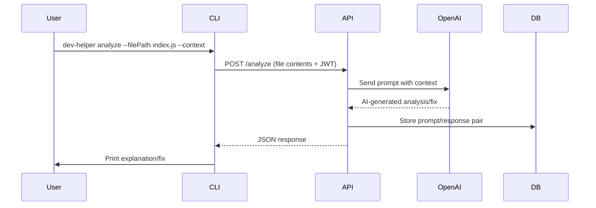

# System Architecture

## 🏗 High-Level Overview
Dev Helper is a **full-stack AI-powered developer assistant** consisting of three primary layers:

1. **CLI (Node.js / Commander)**  
   - User-facing commands (`analyze`, `fix`, `generate`, `scaffold`, `history`, `login`)  
   - Handles input parsing, project context scanning, and API requests  
   - Stores JWT authentication token locally in `~/.dev-helper/config.json`  

2. **Backend API (Express)**  
   - Routes: `/analyze`, `/fix`, `/generate`, `/explain`, `/history`, `/auth/*`  
   - Authentication middleware (JWT verification)  
   - Integrates with OpenAI API for code analysis/fixes  
   - Persists results into MongoDB for history retrieval  

3. **Database (MongoDB)**  
   - Stores users, prompts, responses, and history metadata  
   - Indexed for efficient retrieval (future: pagination, filters, search)  

4. **Frontend (React + Tailwind/shadcn)**  
   - User authentication & session handling  
   - Error submission form (mirrors CLI commands)  
   - History browsing with filters, pagination, and search  
   - Dashboard planned for future SaaS functionality (RBAC, org-level usage)  

---

## 🔄 Request Flow Example (Analyze Command)

---

## 🧩 Components

- **CLI Layer**: Commands + utils (`getToken.js`, `contextHandlerWrapper.js`,`fileScanner.js`)
- **Backend Layer**: Routes, controllers, services, middleware (`auth`, `history`, `openai`)
- **Database Layer**: MongoDB models (User, History)
- **Frontend Layer**: Pages (`/login`, `/analyze`, `/history`) with protected routes

---

## 🔐 Authentication Flow
1. User logs in via CLI (`dev-helper login`) or frontend (`/login`).
2. API verifies credentials and returns a JWT.
3. Token is stored in CLI config file or frontend localStorage.
4. Subsequent API requests include the JWT in headers.
5. Middleware validates token → grants access.

---

## 🌐 Deployment Targets
- **CLI** → npm package (`@mattgraba/dev-helper`)
- **Frontend** → Vercel (Next.js/React build)
- **Backend** → Render/Heroku
- **Database** → MongoDB Atlas

---

🔮 Future Extensions
- Replace MongoDB with Postgres for relational querying (multi-tenant SaaS)
- Add RBAC for team/org accounts
- Context trimming for large repos
- SaaS dashboard: usage analytics, billing, audit logs